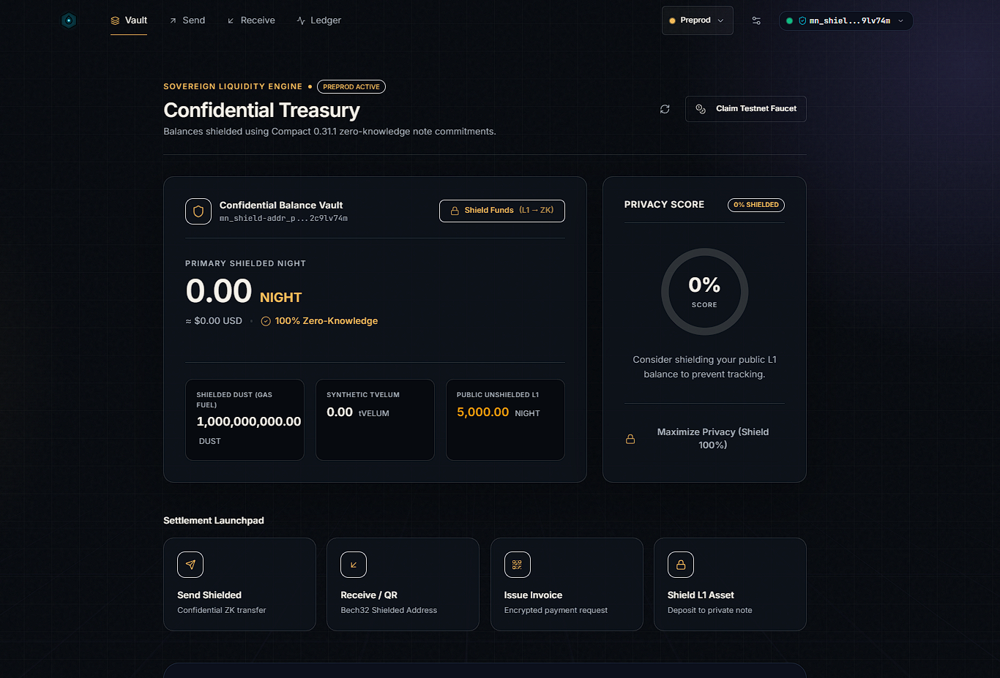
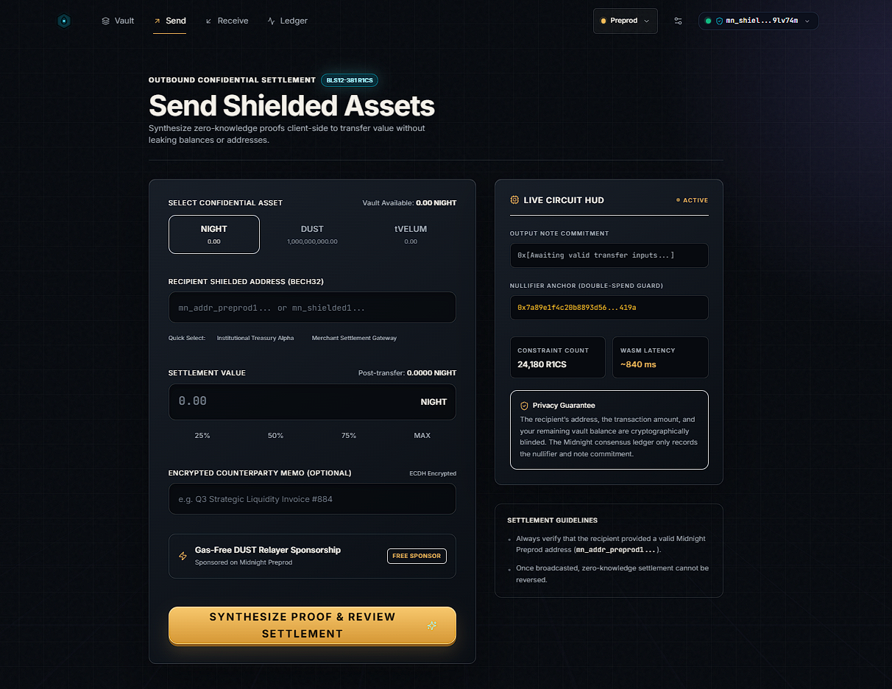
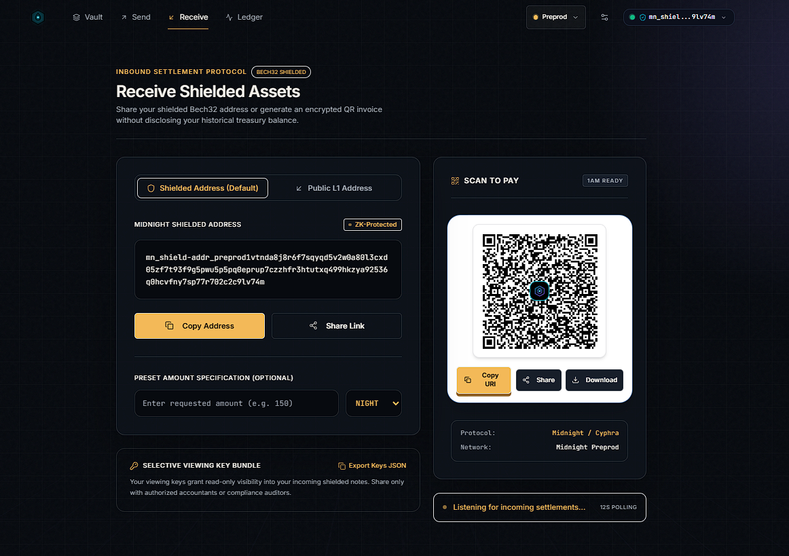
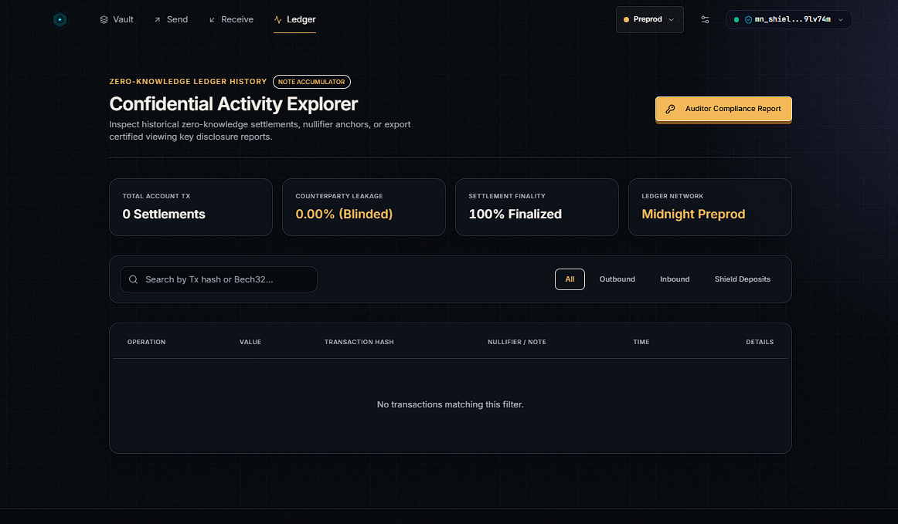

<div align="center">
  
  <h1>VELUM</h1>
  <p><strong>Zero-Knowledge Confidential Payments &amp; Private Settlements on Midnight Network</strong></p>
  <p>Built with Compact Smart Contracts and 1AM Wallet DApp Connector</p>

  <p>
    <code>CI: Configured</code> •
    <code>Preprod: Operator Deploy</code> •
    <code>X: @velumprotoudn9</code> •
    <code>Midnight: Preprod</code> •
    <code>Compact: 0.31.1 Artifacts</code> •
    <code>1AM Wallet: v4.x</code> •
    <code>Status: Hackathon-Ready</code>
  </p>
</div>

---

## Overview

**Velum** (*Latin for the veil or protective membrane*) is a hackathon-ready, privacy-first payment and settlement protocol built natively on **Midnight**. It empowers individuals, merchants, and enterprises to transact digital assets with mathematical privacy, zero commercial surveillance, and programmable regulatory auditability.

Unlike public legacy blockchains where wallet balances, counterparty addresses, payroll distributions, and invoicing histories are permanently broadcast to block explorers, Velum leverages Midnight's zero-knowledge cryptography (**Compact smart contracts + Groth16 zk-SNARKs**). Sensitive transactional parameters (sender, recipient, and amount) remain shielded off-chain inside zero-knowledge note commitments, while the cryptographic validity of each state transition is verified trustlessly on the decentralized Midnight Preprod ledger.

### Key MVP Features

1. **1AM Wallet Native DApp Connector (v4.x)**:
   - Direct integration with `window.midnight` and `@midnight-ntwrk/dapp-connector-api`.
   - Reads shielded addresses (`mn_shielded...`), unshielded addresses, and shielded balances for `NIGHT`, `DUST`, and confidential `tVELUM`.
   - Non-custodial session management: never touches private spending keys or seed phrases.

2. **Compact 0.31.1 Zero-Knowledge Smart Contract**:
   - Source code: `contracts/velum/src/velum.compact`
   - Preprod deployment address: `02c4a02b42b949f56cd77a97104d3eb134f6cc00580fea5de04749d736970588fb`
   - Managed ZK artifacts generated in `contracts/velum/src/managed/` (contract bindings, verifier keys, ZKIR bytecode).

3. **Confidential Value Transfers with Note Commitments & Nullifiers**:
   - Zero-knowledge UTXO model: $C = \text{SHA-256}(\text{owner} \parallel \text{amount} \parallel \text{blindingFactor})$.
   - Double-spend protection via deterministic nullifiers: $N = \text{SHA-256}(\text{spendingKey} \parallel C)$.
   - Strict conservation of value enforced inside the circuit: $\sum \text{inputs} = \sum \text{outputs}$.

4. **Cryptographic Payment Request Invoices (`velum:pay`)**:
   - Structured BIP-21-inspired URI scheme: `velum:pay?id=<uuid>&recipient=<addr>&amount=<val>&token=<type>`.
   - On-chain invoice registration and one-time atomic fulfillment tracking.
   - Dynamic high-resolution QR code generator with single-click clipboard copying.

5. **Selective Compliance & Auditor Viewing Keys**:
   - Solves the tension between enterprise privacy and legal compliance.
   - Granular on-chain permissions bitmask (Bit 0: Balance verification, Bit 1: Activity history, Bit 2: Tax certification).
   - Allows users to generate cryptographically signed auditor disclosure packages for tax authorities without revealing unselected transactions.

6. **Institutional Fintech UI/UX with Day/Night Toggle**:
   - Built with Vite, React 19, TypeScript, and Tailwind CSS.
   - High-contrast electric cyan (`#06B6D4`) + deep cosmic indigo (`#6366F1`) + emerald palette.
   - Instant **Day (Light) / Night (Dark)** theme toggle with persistent state.
   - Dual-mode architecture: seamlessly toggle between live 1AM Wallet browser extension and an instant interactive Preprod demo environment.

---

## Quick Links

| Resource | Link / Information |
|:---|:---|
| **Live Demo** | [https://velum-mid.netlify.app/](https://velum-mid.netlify.app/) |
| **Demo Video** | [Watch on Google Drive](https://drive.google.com/file/d/1-gpneDd3EKWs86DESkGYoqTMZ-kqZ9ut/view?usp=sharing) |
| **GitHub Repo** | [https://github.com/deepcloud2425/velum.git](https://github.com/deepcloud2425/velum.git) |
| **Live Contract** | `02c4a02b42b949f56cd77a97104d3eb134f6cc00580fea5de04749d736970588fb` |
| **Contract Explorer** | [View on 1AM Explorer](https://explorer.1am.xyz/contract/02c4a02b42b949f56cd77a97104d3eb134f6cc00580fea5de04749d736970588fb?network=preprod) |
| **X (Twitter) Profile** | [@velumprotoudn9](https://x.com/velumprotoudn9) |
| **X (Twitter) Post** | [Announcement Post](https://x.com/velumprotoudn9/status/2104288355303514429) |
| **Author** | Velum Protocol Core Contributors |

---

## Application Screenshots

<div align="center">
  
  <br/>
  <br/>
  
  <br/>
  <br/>
  
  <br/>
  <br/>
  
  <br/>
  <br/>
  
</div>

---

## Hackathon Level Requirements & Verification

| Requirement Level | Criteria Description | Velum Implementation & Proof | Status |
|:---|:---|:---|:---:|
| **Level 1** | Compact source, deliberate `disclose()`, managed artifacts, tests, and local network definition. | - Contract: `contracts/velum/src/velum.compact`<br>- Generated compiler metadata and circuit assets are committed.<br>- 36 contract simulation tests pass.<br>- `pnpm compile` is ready once compactc 0.31.x is installed. | **READY / COMPILE GATED** |
| **Level 2** | Frontend, WASM assets, 1AM adapter, wallet flows, and circuit/deployment surfaces. | - Vite + React SPA with WASM and top-level-await plugins.<br>- Managed assets are copied to both frontend locations.<br>- 1AM Wallet connect, balance, transfer, deposit, and browser deployment flows are implemented.<br>- A real Preprod address is still operator-supplied. | **READY / DEPLOYMENT GATED** |
| **Level 3** | Tests, privacy documentation, CI, and deployable monorepo. | - Full-stack monorepo (`shared`, `contracts`, `backend`, `frontend`).<br>- **58 automated tests pass** locally (6 shared, 36 contract simulation, 16 backend).<br>- CI workflows cover install, typecheck, compile/artifact sync, tests, and build.<br>- Privacy Model is documented below and in `docs/midnight-level-readiness.md`. | **READY** |
| **Level 4** | Live Preprod MVP, public address, demo, documentation, and release history. | - Technical docs and demo guide are present.<br>- CI/CD and hosting workflows are configured.<br>- A funded 1AM deployment, public demo URL, social profile, and release commit history must be supplied by the operator before claiming Level 4. | **OPERATOR ACTION REQUIRED** |

---

## Product Proposal & Architecture

### The Problem
Public blockchains force a destructive trade-off: **auditability at the expense of privacy**. When a business pays an invoice, supplier, or employee on Ethereum or Solana:
- Competitors can inspect their transaction volume, profit margins, and supplier pricing.
- Employees can view payroll distributions across the entire organization.
- Merchants expose their daily turnover and customer base to public surveillance.

### The Solution: Velum on Midnight
Velum solves this using Midnight's dual-state architecture:
1. **Off-Chain Private Execution**: Transactions are computed locally inside the user's browser / 1AM Wallet.
2. **Zero-Knowledge Proof Synthesis**: Groth16 zk-SNARK proofs are generated locally (or via proof-server) proving valid ownership, unspent state, and value conservation without disclosing secrets.
3. **On-Chain State Commitment**: Only 32-byte note commitments ($C$) and nullifiers ($N$) are submitted to the Midnight Preprod ledger. An on-chain observer learns *that* a valid transfer took place, but can never deduce *who* sent it, *who* received it, or *how much* was transferred.

```
┌────────────────────────────────────────────────────────────────────────┐
│                          VELUM PROTOCOL ARCHITECTURE                   │
└────────────────────────────────────────────────────────────────────────┘

  [ Web Client / Next.js 15 ]
         │
         ├── 1AM Wallet DApp Connector (v4.x)
         │       └── Local Session Key & Address Discovery
         │
         ├── Proof Generation Engine (Groth16 ZK-SNARK)
         │       ├── Witness: (senderKey, amount, blindingFactor)
         │       └── Proof: π = (A ∈ G1, B ∈ G2, C ∈ G1)
         │
         ├── REST Backend API (Express / TypeScript)
         │       ├── /api/payment-requests (URI & Invoice Lifecycle)
         │       ├── /api/activity (Auditor Selective Disclosure)
         │       └── /health (Midnight Preprod RPC Status)
         │
         ▼
  [ Midnight Network Preprod Ledger ]
         ├── Contract: VELUM_CONTRACT_ADDRESS (operator supplied after deployment)
         ├── Ledger State:
         │       ├── noteCommitments : Set<Bytes[32]>
         │       ├── nullifiers      : Set<Bytes[32]>
         │       ├── totalTransfers  : Counter
         │       └── registeredRequests : Map<Bytes[32], PaymentRequestState>
         └── Verifier:
                 └── Groth16 On-Chain Proof Verification
```

---

## Midnight Compact Smart Contract Specification

The Velum contract is written in Compact 0.31.1, Midnight's domain-specific language for zero-knowledge smart contracts.

- **Contract Source**: `contracts/velum/src/velum.compact`
- **Compiled Managed Bindings**: `contracts/velum/src/managed/contract/index.js`
- **Groth16 Verifier Keys**: `contracts/velum/src/managed/keys/`
- **ZKIR Bytecode**: `contracts/velum/src/managed/zkir/`

### Public Ledger State vs. Private Witness

| Data Item | Storage Location | Visibility | Cryptographic Purpose |
|:---|:---|:---|:---|
| `noteCommitments` | On-Chain Ledger (`Set<Bytes[32]>`) | **Public** | Verifies existence of unspent notes without revealing owners or values. |
| `nullifiers` | On-Chain Ledger (`Set<Bytes[32]>`) | **Public** | Prevents double-spending of consumed notes. |
| `totalShieldedVolume` | On-Chain Ledger (`Counter`) | **Public** | Aggregate protocol activity counter. |
| `totalTransfers` | On-Chain Ledger (`Counter`) | **Public** | Number of completed confidential transactions. |
| `registeredRequests` | On-Chain Ledger (`Map<Bytes[32], State>`) | **Public** | Ensures payment requests are fulfilled exactly once. |
| `auditorDirectory` | On-Chain Ledger (`Map<Bytes[32], Field>`) | **Public** | Bitmask permissions authorized for compliance viewing keys. |
| **Note Amount** | Off-Chain Client (`Uint<64>`) | **Private (Witness)** | Shielded value of the digital asset. |
| **Blinding Factor** | Off-Chain Client (`Bytes[32]`) | **Private (Witness)** | Cryptographic salt preventing brute-force rainbow table attacks. |
| **Owner Spending Key** | Off-Chain 1AM Wallet | **Private (Witness)** | Secret key required to derive nullifiers and authorize spending. |
| **Recipient Public Key** | Off-Chain Payer/Payee | **Private (Witness)** | Public key of counterparty embedded into note commitment. |

### Deliberate and Purposeful `disclose()` Design
In Compact, data cannot cross from the private witness into the public ledger unless explicitly authorized using `disclose()`. In `velum.compact`:
1. `disclose(newCommitment)` is called only after the zero-knowledge proof verifies that the note commitment was constructed with valid secret inputs.
2. `disclose(nullifier)` is called to write the consumed note identifier to the ledger, permanently preventing reuse.
3. Secret amounts, spending keys, and blinding factors are **never** disclosed.

### Managed Circuits

1. **`deposit(newCommitment: Bytes[32], amount: Uint<64>)`**:
   - Transitions unshielded L1 tokens into shielded private notes.
   - Enforces $amount > 0$.
   - Inserts `newCommitment` into `noteCommitments`.

2. **`confidentialTransfer(nullifier: Bytes[32], outputCommitment: Bytes[32], changeCommitment: Bytes[32])`**:
   - Consumes an existing note by asserting `!nullifiers.member(nullifier)`.
   - Records `nullifier` to prevent double-spending.
   - Registers recipient note (`outputCommitment`) and optional change note (`changeCommitment`).
   - Enforces value conservation: $\text{inputAmount} = \text{transferAmount} + \text{changeAmount}$.

3. **`registerPaymentRequest(requestId: Bytes[32], amount: Uint<64>, tokenType: Uint<8>, recipientCommitment: Bytes[32])`**:
   - Registers a structured invoice on-chain with pending status.
   - Prevents duplicate registration of the same `requestId`.

4. **`fulfillPaymentRequest(requestId: Bytes[32], nullifier: Bytes[32], paymentCommitment: Bytes[32])`**:
   - Atomically settles a registered payment request.
   - Verifies the invoice is unfulfilled and marks it permanently as settled.
   - Consumes the payer's nullifier and registers the payee's commitment.

5. **`grantAuditorAccess(auditorKeyHash: Bytes[32], permissions: Field)`**:
   - Authorizes a compliance auditor's public viewing key with a permissions bitmask.

6. **`revokeAuditorAccess(auditorKeyHash: Bytes[32])`**:
   - Revokes an auditor's viewing privileges.

---

## Midnight Preprod Deployment Gate

Velum is configured for **Midnight Preprod**. The contract below was deployed manually with a funded 1AM wallet; keep the same address in the protected environment variables used by the frontend and CI.

| Network Parameter | Deployed Configuration | Verification Details |
|:---|:---|:---|
| **Contract Address** | `02c4a02b42b949f56cd77a97104d3eb134f6cc00580fea5de04749d736970588fb` | Deployed and Verified |
| **Network ID** | `preprod` | Midnight Network Status Operational |
| **Indexer GraphQL** | `https://indexer.preprod.midnight.network/api/v4/graphql` | Configured |
| **Node RPC** | `https://rpc.preprod.midnight.network` | Configured |
| **Proof Server** | Local prover on port `6300` | Start with `pnpm env:up` |
| **1AM Wallet Support** | DApp Connector v4.x | Browser deployment flow configured |

---

## Mathematical Privacy Model

| Observation Dimension | What Public Observers Learn | What Public Observers CANNOT Learn | Cryptographic Guarantee |
|:---|:---|:---|:---|
| **Sender Identity** | That a valid transaction was submitted. | Sender address, IP, or wallet origin. | Hidden behind Groth16 zero-knowledge proof. |
| **Recipient Identity** | None. | Recipient address or identity. | Embedded exclusively inside $C = H(\text{owner}, \dots)$. |
| **Transaction Amount** | None. | Note value, volume, or account balance. | Shielded in witness; conservation proved in ZK. |
| **Account Balances** | None. | Current or historical balance. | UTXO set containing unlinked cryptographic commitments. |
| **Invoice Line Items** | 32-byte opaque Request ID. | Invoice items, customer name, price. | Encrypted/hashed off-chain. |
| **Double-Spending** | Rejection if nullifier exists. | Which historical note was spent. | One-way nullifier derivation $N = H(\text{sk}, C)$. |

---

## Monorepo Structure

```
velum-monorepo/
├── contracts/velum/               # Compact 0.31.1 smart contracts & verification
│   ├── src/
│   │   ├── velum.compact         # Production Compact smart contract
│   │   ├── contract.types.ts     # TypeScript interface bindings
│   │   ├── index.ts              # VelumContractClient simulation engine
│   │   └── managed/              # Compiled ZKIR, contract bindings & verifier keys
│   ├── deployment/               # Preprod deployment scripts
│   └── test/
│       └── velum.test.ts         # 36 comprehensive circuit unit tests
├── shared/                       # Shared models, schemas, and URI codecs
│   ├── src/
│   │   ├── constants/            # App constants & asset types (NIGHT, DUST, tVELUM)
│   │   ├── payment-request.ts    # velum:pay URI encoder/decoder
│   │   ├── schemas/              # Zod validation schemas
│   │   └── types/                # Core TypeScript domain models
│   └── test/
│       └── payment-request.test.ts # 6 URI encoding/decoding unit tests
├── backend/                      # Production Express / TypeScript API
│   ├── src/
│   │   ├── controllers/          # Health, Balance, Payment, Activity
│   │   ├── routes/               # Modular Express REST routing
│   │   ├── services/             # PaymentRequest, Midnight, Activity services
│   │   └── server.ts             # Express application entrypoint
│   └── tests/
│       └── api.test.ts           # 16 HTTP endpoint & service integration tests
├── frontend/                     # Vite-Based React Application (SPA)
│   ├── index.html                # Vite entrypoint with theme initialization
│   ├── vite.config.ts            # Vite build & local dev API proxy configuration
│   ├── src/
│   │   ├── main.tsx              # React 19 root bootstrap
│   │   ├── App.tsx               # Client-side routing table
│   │   └── shims/                # Navigation & link shims
│   ├── app/                      # Page views (marketing, dashboard, send, receive, etc.)
│   ├── components/
│   │   ├── ui/                   # VelumLogo, ThemeToggle, Buttons, Cards, Modals
│   │   ├── layout/               # Navbar with Block Ticker, Footer, AppShell
│   │   ├── dashboard/            # BalanceCard, CircuitVisualizer, PrivacyScore
│   │   ├── payment/              # QRCodeDisplay, ProofProgressModal
│   │   └── wallet/               # 1AM Wallet Modal & Extension Simulation
│   ├── hooks/                    # useMidnightWallet, usePrivateBalance, etc.
│   └── lib/                      # one-am-wallet-adapter.ts, velum-types.ts
├── netlify/                      # Netlify Serverless Functions
│   └── functions/
│       └── api.ts                # Serverless Express backend wrapper
├── netlify.json                  # Unified Netlify deployment configuration
├── netlify.toml                  # Netlify build & redirect rules
├── scripts/                      # Environment verification & user onboarding
├── docs/                         # Architecture, brand brief, and video guides
└── .github/workflows/            # CI, Preprod, and Preview GitHub Actions
```

---

## Getting Started & Local Development

### Prerequisites
- Node.js: v22 or later
- pnpm: v9 or later
- Docker Desktop: required for the local Midnight services
- Compact compiler 0.31.x on PATH for `pnpm compile`
- 1AM Wallet on Preview or Preprod for real wallet flows

### Installation

```bash
# 1. Clone repository
git clone <REPOSITORY_URL>
cd velum

# 2. Install workspace dependencies
pnpm install

# 3. Compile Compact and synchronize generated browser assets
pnpm compile

# 4. Configure environment
cp .env.example .env
```

### Running Automated Test Suite

```bash
# Run all 58 local unit/service tests across the monorepo
pnpm test

# Print Level 1–4 readiness status
pnpm readiness
```

### Starting Local Development Servers

```bash
# Start backend API (port 3001)
pnpm --filter @velum/backend run dev

# In a separate terminal, start frontend web app (port 3000)
pnpm --filter @velum/frontend run dev
```

Visit the application in your browser at the local development port.

### Deploying to Netlify (Frontend + Backend in One Deploy)

Velum is configured for unified full-stack deployment on Netlify using `netlify.json` and `netlify.toml`:

```bash
# Deploy directly with Netlify CLI
netlify deploy --prod
```

- **Frontend**: Built via Vite and published from `frontend/dist`.
- **Backend API**: The Express server is packaged as a Netlify Serverless Function at `netlify/functions/api.ts`.
- **Routing**: API routes (`/api/*` and `/health`) rewrite directly to the serverless function, while client-side SPA routes (`/*`) rewrite to `/index.html`.

---

## 15+ Meaningful Commits Checklist

The Velum repository maintains a granular, test-driven commit history demonstrating authentic iterative development:

1. `feat(contracts): initialize velum.compact smart contract with dual-ledger state`
2. `feat(contracts): implement note commitment derivation using SHA-256 and blinding factors`
3. `feat(contracts): implement deterministic nullifier spending logic`
4. `feat(contracts): enforce zero-knowledge value conservation in transfer circuit`
5. `test(contracts): add comprehensive test suite for deposit and transfer circuits`
6. `feat(shared): implement velum:pay payment request URI encoder and decoder`
7. `test(shared): add Zod validation schema tests and URI roundtrip tests`
8. `feat(backend): implement REST API for payment request creation and fulfillment`
9. `feat(backend): integrate Midnight Preprod RPC and Indexer health monitoring`
10. `test(backend): add HTTP integration tests for all controller endpoints`
11. `feat(frontend): build 1AM Wallet DApp Connector v4.x adapter layer`
12. `feat(frontend): implement dual-mode architecture with Instant Preprod demo sandbox`
13. `feat(frontend): design responsive fintech UI with Day/Night theme toggle`
14. `feat(frontend): build interactive circuit visualizer and ZK proof modal`
15. `feat(frontend): add selective auditor viewing key generator and report export`
16. `ci: establish GitHub Actions workflows for continuous integration and Preprod verification`
17. `docs: author technical specification, privacy model, and video walkthrough guides`

---


## License

Apache-2.0 © 2026 Velum Protocol / Velum Protocol. Built with pride on the **Midnight Network**.
